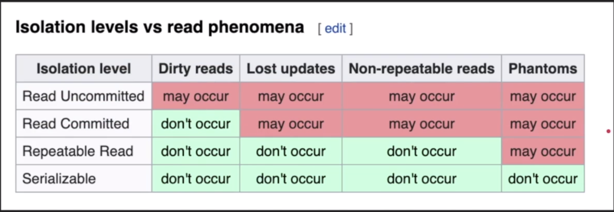

## DB Transactions

BEGIN

- Write changes to disk (IO) and then commit - commit is faster everything is already on the disk
- Write changes to memory and then commit - commit is slower, need to write each query result to disk
  COMMIT
- Postgres has fastest commits - does a lot of IO
  ROLLBACK
- if everything was written to disk, rollback is slower
- if everything was kept in memory, rollback is fast - just flush what's in memory

Read-only transaction - generate a report with a consistent snapshot based at the time of transaction

## Atomicity

Can't be split = one item
Critical concept for all DB systems - graph, noSQL, etc.

All of queries considered to be one unit of work - all must succeed
If any of the queries in transaction failed, all prior successful queries must rollback
If DB went down before commit of a successful transaction - must rollback

Lack of atomicity leads to inconsistency

## Isolation

Read configurations

While in a transaction
Dirty read

- read uncommitted changes by other queries
  Non-repeatable read
- read committed changes (UPDATE) by other queries
  Phantom read
- read new writes (INSERT) by other queries
  Lost updates
- two concurrent transactions where one overrides the other one's changes

While running a transaction can configure the isolation level - from fastest to slowest

- Read uncommitted - a.k.a Dirty read
- Read committed - same as non-repeatable read
- Repeatable Read - to avoid non-repeatable read (MySQL default isolation level)
  - only in PostgresQL avoids phantom reads
- Snapshot - avoids even phantom reads, takes snapshot of DB at the start of transaction - adds timestamp
- Serializable - transactions run one after another
  - make sure to retry queries as concurrent queries can fail

The transaction will always see the changes it makes regardless of the isolation level. Isolation level only applies to other concurrent transactions.

From wikipedia

## Consistency

Consistency in Data

- Defined by the user who builds the DB
- referential integrity - foreign key is pointing to non-existing data
- Atomicity - if transaction crashes = inconsistency == corrupt data
- Isolation - inconsistent read results

Consistency in reads - whenever data is updated, next read must give the updated value - new version

## Durability

If system/computer crashed after transaction was committed, they must be still present after restart.
Expensive operation - need to write all the commits into disk, some DBs optimize the speed by keeping commits in memory (which would be flushed on crash) and write to the disk in batches, e.g. Redis.

Durability techniques

- WAL - Write ahead log
- Asynchronous snapshot
- AOF
